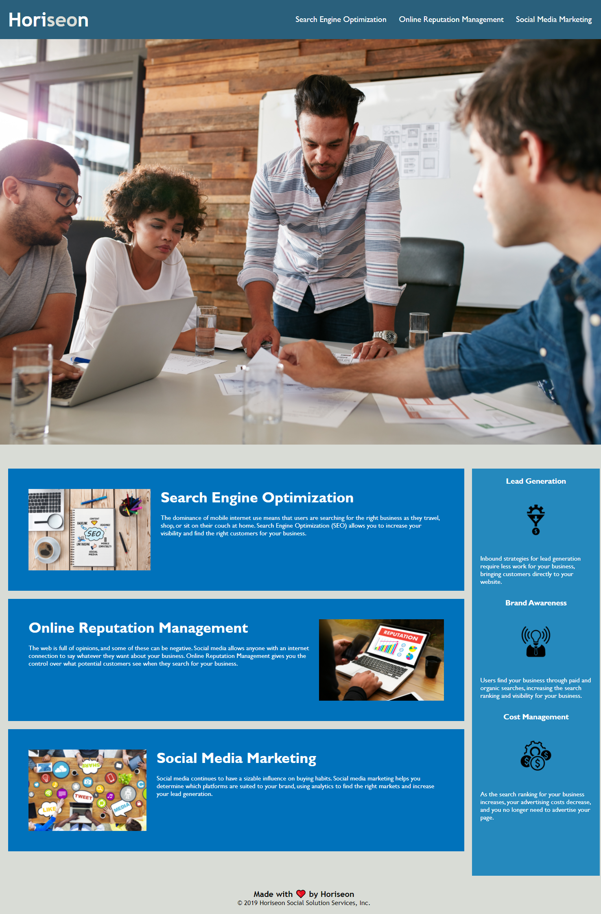

# The Task
 *The homework assignment was about how a marketing agency has hired me to refactor an existing site to make it more accessible. I reviewed the Homework Guide before I start working on this assignment. I began with starter code that was needed to be modified.* 

**Completed Acceptance Criteria**:

1. I followed the Scout Rule and left the code a little cleaner than when i found it.
2. I applied semantic HTML elements replacing all 
 elements.
3. The semantic HTML elements follow a logical structure independent of styling and positioning.
4. I included alts attributes in images for easy accessibility.
5. The heading attributes falls in sequential order.
6. I included a well illustrated title element.

**Bonus changes**:

1. I made sure all links are functioning correctly.
2. I made changes in the CSS style to make it efficient and accurate.
3. I organized CSS to follow the semantic structure of the HTML elements.
4. I also included comments on each element i updated in html and CSS.

**What did i do to complete this assingment?**:

*I had to learn how to get started with Refactoring existing code (improving it without changing what it does) to meet a certain set of standards or to implement a new technology.I had to understand the webpage purpose and content Research sources to clearly understand key concepts. I used the inspect section to figure out how the HTML and CSS code was written. I had to learn "What code refactoring is in Semantic HTML?". what is Web accesibility standards and How to edit Markdown files while Properly making use of a README.mb file Apply above concepts in the revision.*

**The Result**
*With the help of everyone combining to find the research, use application of concepts, and making specific changes to the files, we were able to ensure an accesible, efficient, and easy to read project.*

**Website**

**Git Hub**
*My project was pushed to GitHub at the following repository*: https://github.com/syke2good/Refactomaniac

*You can access the deployed application with the GitHup Pages link*: https://syke2good.github.io/Refactomaniac/

**Sources**
- Code refactoring

- Semantic HTML

- Web accessibility standards

- Markdown and Visual Studio Code

- Make a README

- Interactive tutorial

**License**
Copyright (c) 2012-2021 Scott Chacon and others

Permission is hereby granted, free of charge, to any person obtaining
a copy of this software and associated documentation files (the
"Software"), to deal in the Software without restriction, including
without limitation the rights to use, copy, modify, merge, publish,
distribute, sublicense, and/or sell copies of the Software, and to
permit persons to whom the Software is furnished to do so, subject to
the following conditions:

The above copyright notice and this permission notice shall be
included in all copies or substantial portions of the Software.

THE SOFTWARE IS PROVIDED "AS IS", WITHOUT WARRANTY OF ANY KIND,
EXPRESS OR IMPLIED, INCLUDING BUT NOT LIMITED TO THE WARRANTIES OF
MERCHANTABILITY, FITNESS FOR A PARTICULAR PURPOSE AND
NONINFRINGEMENT. IN NO EVENT SHALL THE AUTHORS OR COPYRIGHT HOLDERS BE
LIABLE FOR ANY CLAIM, DAMAGES OR OTHER LIABILITY, WHETHER IN AN ACTION
OF CONTRACT, TORT OR OTHERWISE, ARISING FROM, OUT OF OR IN CONNECTION
WITH THE SOFTWARE OR THE USE OR OTHER DEALINGS IN THE SOFTWARE.